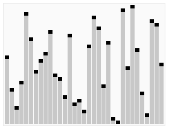

## js实现快排、冒泡、希尔排序、选择排序

常见的内部排序算法有：插入排序、希尔排序、选择排序、冒泡排序、归并排序、快速排序、堆排序、基数排序等。

如图：


### 快速排序

##### 1.1算法描述

快速排序由于排序效率在同为O(N*logN)的几种排序方法中效率较高，因此经常被采用，再加上快速排序思想----分治法也确实实用。快速排序是一种既不浪费空间又可以快一点的排序算法。

###### 1.2 算法步骤

* 先从数列中取出一个数作为“基准”。
* 分区过程：将比这个“基准”大的数全放到“基准”的右边，小于或等于“基准”的数全放到“基准”的左边。
* 再对左右区间重复第二步，直到各区间只有一个数。



#### 1.3算法实现

```javaScript
function quickSort(arr){
  if(arr.length<=1){
    return arr;
  }

  var pointIndex = Math.floor(arr.length/2); //基准位置（理论上可任意选取）
  var point = arr.splice(pointIndex,1); //获得基准数
  var left = [],
      right = [];
  for(var i = 0; i<arr.length; i++){
    if(arr[i]<point){
      left.push(arr[i]);
    }else{
      right.push(arr[i]);
    }
  }

  return arguments.callee(left).concat(point,arguments.callee(right));
}
```

### 选择排序

#### 1.1 算法描述

选择排序是一种简单直观的排序算法，无论什么数据进去都是O(n2) 的时间复杂度。所以用到它的时候，数据规模越小越好。唯一的好处可能就是不占用额外的内存空间了吧。通俗来说就是你们中间谁最小谁就出列，站到队列的最后边，然后继续对着剩余的无序数组说你们中间谁最小谁就出列，站到队列的最后边，一直到最后一个，继续站到最后边，这样数组就有了顺序，从小到大。

#### 1.2 算法步骤

* 在未排序序列中找到最小（大）元素，存放到排序序列的起始位置
* 从剩余未排序元素中继续寻找最小（大）元素，然后放到已排序序列的末尾。
* 重复第二步，直到所有元素均排序完毕。

#### 1.3 算法实现

```javaScript
function selectionSort(arr){
  if(arr.length<=1){ return arr };
  var len = arr.length;
  var minIndex, temp;

  for(var i = 0; i<len-1; i++){
    minIndex = i;
    for(var j = i+1; j<len; j++){
      if(arr[j] < arr[minIndex]){ // 寻找最小的数
        minIndex = j;             // 将最小数的索引保存
      }
    }
    temp = arr[i];
    arr[i] = arr[minIndex];
    arr[minIndex] = temp;
  }

  return arr;
}
```
### 插入排序
#### 1.1算法描述
插入排序是指，先假定将n个元素的数列分为已有序和无序两个部分；然后将无序数列的第一个元素与有序数列的元素从后往前逐个进行比较，找出插入位置，将该元素插入到有序数列的合适位置中。

#### 1.2算法实现

```javaScript
function insertionSort(arr){
  let len = arr.length;
  if(len <= 1){
    return arr;
  }

  for(var i = 1; i < len; i++){
    var k = arr[i];
    var j;
    for(j = i-1; j>=0 && k < arr[j]; j--){
      arr[j+1] = arr[j];
    }
    arr[j+1] = k;
  }
  return arr;
}
```
### 希尔排序

#### 1.1 算法描述

希尔排序，也称递减增量排序算法，是插入排序的一种更高效的改进版本。但希尔排序是非稳定排序算法。
希尔排序是基于插入排序的以下两点性质而提出改进方法的：

* 插入排序在对几乎已经排好序的数据操作时，效率高，即可以达到线性排序的效率；
* 但插入排序一般来说是低效的，因为插入排序每次只能将数据移动一位；

希尔排序的基本思想是：先将整个待排序的记录序列分割成为若干子序列分别进行直接插入排序，待整个序列中的记录基本有序时，再对全体记录进行依次直接插入排序。


#### 1.2 算法步骤
* 选择一个增量序列 t1，t2，……，tk，其中 ti > tj, tk = 1；
* 按增量序列个数 k，对序列进行 k 趟排序；
* 每趟排序，根据对应的增量 ti，将待排序列分割成若干长度为 m 的子序列，分别对各子表进行直接插入排序。仅增量因子为 1 时，整个序列作为一个表来处理，表长度即为整个序列的长度。

#### 1.3 算法实现
```javaScript
 function shellSort(){
   var len = arr.length,
       temp,
       gap = 1;
    while(gap < len/3){
      gap = gap*3+1;
    }
    for(gap; gap > 0; gap = Math.floor(gap/3)){
      for(var i =gap; i<len; i++){
        temp = arr[i];
        for(var j = i-gap; j >= 0 && arr[j] > temp; j -= gap){
          arr[j+gap] = arr[j];
        }
        arr[j+gap] = temp;
      }
    }
    return arr;
 }
```

### 冒泡排序

#### 1.1算法思想

每一次对比相邻两个数据的大小，小的排在前面，如果前面的数据比后面的大就实现两个数的交换。

要实现上述规则需要用到两层for循环，外层从一个数到倒数第二个数，内层从外层的后面一个数到最后一个数。

#### 1.2算法实现

```javaScript
function bubbleSort(arr){
  if(arr.length<=1){ return arr };

  for(var i = 0; i<arr.length-1; i++){
    for(var j = i+1; j<arr.length; j++){
      if(arr[i]>arr[j]){
        var temp = arr[i];
        arr[i] = arr[j];
        arr[j] = temp;
      }
    }
  }

  return arr;
}
```
