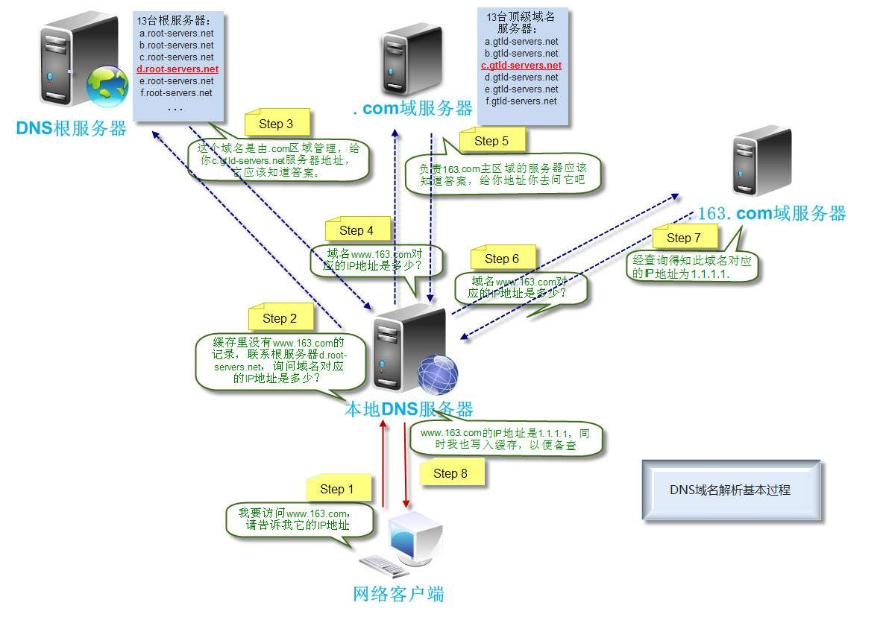

## DNS域名解析

DNS（Domain Name System，域名系统），万维网上作为域名和IP地址相互映射的一个分布式数据库，能够使用户更方便的访问互联网，而不用去记住能够被机器直接读取的IP数串。通过域名，最终得到该域名对应的IP地址的过程叫做域名解析（或主机名解析）。DNS协议运行在UDP协议之上，使用端口号53。

当一个用户在浏览器中输入一个域名url时，DNS解析会依次执行以下10个步骤：
1. 浏览器会检查浏览器的缓存中有没有这个域名对应的IP地址，如果有，解析过程结束； 如果没有，继续第二步。
2. 浏览器查找操作系统缓存中，是否有这个域名对应的DNS解析的IP地址，同时这个解析结果是可以配置的。
   > 1.  Windows中通过C:\Windows\System32\drivers\etc\hosts文件来配置；
   > 2. Linux通过\etc\hosts文件来配置；
   > 3. 如果仍然没有获得IP地址，则进入真正的请求域名服务器阶段。

3. 操作系统将这个域名发送给本地的域名服务器（Local DNS Server）,这个服务器的地址就是我们在网络配置中心的DNS服务器地址，如果你是在小区接入的互联网，那么这个DNS服务器就是提供给你接入互联网的应用提供商，如电信或联通，通常这个服务器离你家不会太远；如果你是在学校接入的互联网，那么这个服务器一定在学校内。查看这个DNS服务器的地址有两种，  Windows平台：打开命令符界面（cmd），输入ipconfig查看； Linux平台：cat/etc/resolv.conf 查看。 到这一步，一般（80%）都会获得缓存的IP地址，如果未获得，则继续；
4. 直接到RootServer根域名服务器请求；
5. 获得主域名服务器地址gTLD地址；gTLD是国际顶级域名服务器，如.com, .cn , .org 等，全球一共只有13台左右。
6. 本地域名服务器向gTLD服务器发送请求；
7. gTLD查找并返回此域名对应的Name Server域名服务器的地址，这个Name Server通常就是你注册的域名服务器。例如你在某个域名服务提供商申请的域名，那么这个域名解析任务就由这个域名提供商的服务器来完成；
8. Name Server域名服务器会查询存储的域名和IP的对应关系表，在正常情况下，都根据域名得到目标IP的记录，连同一个TTL值返回给Name Server域名服务器。(TTL(Time-To-Live/生存时间)，是一个域名解析记录在DNS服务器中的存留时间。)
9. 返回该域名对应的IP和TTP值，Local DNS Server会缓存这个域名和IP的对应关系，缓存的时间由TTL控制；
10. 把返回的结果返回给用户，用户根据TTL值缓存在本地系统中，域名解析过程结束。

**在实际的DNS解析中，可能还不止这10个步骤，如Name Server可能会有多个，或者有一个GTM来负载均衡控制。**
